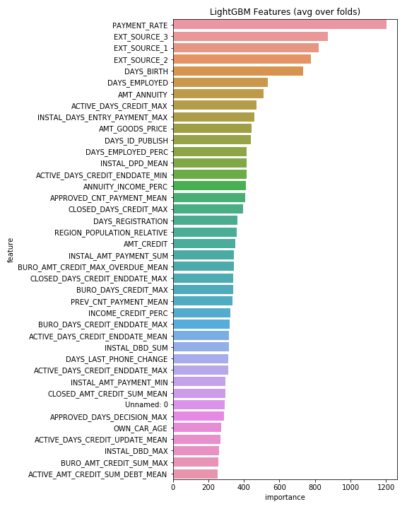

# Home Credit Default Risk

This is a program solving the Home Credit Default Risk Kaggle Competition. 

The motivation of this project is that many people struggle to get loans due to insufficient or non-existent credit hostories. And, unfortunately, this population is often taken advantage of by untrustworthy lenders. In order to make sure this underserved population has a positive loan experience, Home Credit makes use of a variety of alternative data--including telco and transcation information--to predict their client's repayment abilities. 

The data is provided by Home Credit company. The output is the probability that each individual will repay the loan or not. 

## Data (688 MB)
* application_test.csv $48.7k \times 121$
* applcation_train.csv $308k \times 122$

Features are basic information from banks including code_gender, flag_own_car, flag_own_realty, cnt_children, amt_income_total, amt_credit, amt_annuity, amt_goods_price, name_education_type, name_family_status...

* bureau.csv $1.72m \times 17$

Features arecredit information such as: credit_active, credit_currency, days_credit...

* bureau_balance.csv $27.3m \times 3$

Features are months_balance and status. 

* credit_card_balance $3.84m \times 23$

Features are information about credit cards including months_balance, amt_balance, amt_credit_limit_actual...

* installments_payments.csv $13.6m \times 8$

Features are information about instalments such as num_instalment_version, num_installment_number, days_instalment...

* POS_CASH_balance.csv $10.0m \times 8$

Features are information about POS_CASH_balance including months_balance, cnt_instalment, cnt_instalment_future, name_contract_status... 

* previous_application.csv $1.67m \times 37$

Features are information about previous applications including amt_annuity, amt_application, amt_credit...

Here is a figure to illustrate all the data. 

## Preprocessing - [Exploratory data analysis](Home_Credit_EDA.ipynb) 

## Preprocessing - [Data Merging and Augmentation](Home_Credit_Data_Augmentation.ipynb) 
This is the jupyter notebook for data preprocessing --merging and augmentation. After preprocessing, the size of train data is (356251,798).

## Preprocessing - [LightGBM Feature Importance](Home_Credit_Feature_Selecting)
This is the feature importance given by LightGBM model. 

